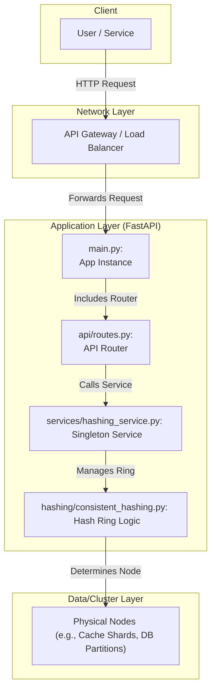

***

# Consistent Hashing Service

A modular, production-ready Python microservice using FastAPI that demonstrates consistent hashing for scalable, low-resharding key distribution across nodes. Includes clean architecture, centralized logging, lifespan startup, and pytest-based tests.

## Features

*   Consistent hashing with virtual nodes (replicas) for even distribution
*   Add/remove nodes dynamically via API
*   Deterministic key-to-node routing (no central key map)
*   Production logging with rotating file handlers
*   Clear modular structure: API, services, core, hashing
*   Unit and integration tests with `pytest`

## Why Consistent Hashing?

Consistent hashing maps both nodes and keys onto a hash ring so that:
*   Only a small fraction of keys move when nodes join/leave
*   Load distribution stays balanced using virtual nodes
*   Routing is stateless and deterministic (hash-based)

This service acts as a “shard locator.” It returns the responsible node for any key; your client or gateway routes the actual read/write to that node’s backend (cache shard, DB partition, etc.).

## Architecture Diagram

This diagram represents the components and flow of the Consistent Hashing Service.



## Project Structure

```
consistent-hashing-service/
│
├── app/
│   ├── api/
│   │   └── routes.py           # FastAPI route definitions
│   ├── core/
│   │   ├── config.py           # Application configuration
│   │   └── logger_config.py    # Centralized logging setup
│   ├── hashing/
│   │   └── consistent_hashing.py # The core hashing algorithm
│   ├── services/
│   │   └── hashing_service.py  # Business logic for the hash ring
│   └── main.py                 # Main FastAPI app initialization
│
├── tests/
│   ├── test_api.py             # Integration tests for the API
│   └── test_consistent_hashing.py # Unit tests for the hashing logic
│
├── requirements.txt
└── README.md
```

## API Endpoints

| Endpoint                | Method | Description                                  |
| ----------------------- | ------ | -------------------------------------------- |
| `/api/get-node/{key}`   | `GET`  | Returns the node responsible for `key`       |
| `/api/nodes/{node}`     | `POST` | Adds a node to the consistent hash ring      |
| `/api/nodes/{node}`     | `DELETE`| Removes a node from the consistent hash ring |
| `/api/nodes`            | `GET`  | Lists all current nodes in the ring          |

**Example Usage:**

```bash
# Get the node for a specific key
curl http://localhost:8000/api/get-node/user:123

# Add a new node to the cluster
curl -X POST http://localhost:8000/api/nodes/cache-node-4

# Remove a node from the cluster
curl -X DELETE http://localhost:8000/api/nodes/cache-node-2
```

## Quickstart

**1. Prerequisites**
*   Python 3.11
*   Conda (recommended)

**2. Clone and Setup**
```bash
# Clone the repository
git clone https://github.com/pritambhutada5/system_design.git
cd consistent-hashing-service

# Create and activate a conda environment
conda create -n consistent_hashing python=3.11 -y
conda activate consistent_hashing

# Install dependencies
pip install -r requirements.txt
```

**3. Run the Service**
```bash
  uvicorn app.main:app --reload
```
The API will be available at `http://localhost:8000`. Interactive documentation can be found at `http://localhost:8000/docs`.

## Testing

The project includes unit and integration tests using `pytest`. To run the test suite:
```bash
  pytest
```

## Logging

*   **API Logs**: All logs related to API requests and the application lifecycle are stored in `api.log`.
*   **Hashing Logs**: Logs from the core hashing logic (node additions, removals, and key lookups) are stored in `hashing.log`.
*   Both loggers also output to the console.
